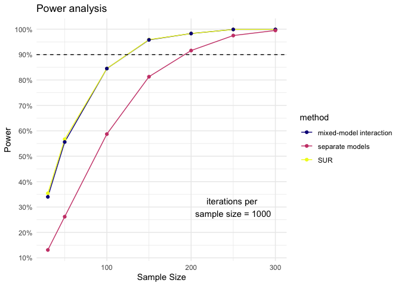

```r
# load required packages
library("lme4")        # model specification / estimation
library("lmerTest")    # get p-values for mixed models
library("broom.mixed") # extracting data from model fits 
library("tidyverse")   # data wrangling and visualisation
```

```
## Warning: package 'stringr' was built under R version 4.2.3
```

```r
library("patchwork")    # combine plots
library(systemfit)

# ensure this script returns the same results on each run
set.seed(912783)
```

Statistical power is the probability by which we are able to detect an effect, assuming that it actually exists. The higher you set the benchmark for statistical power, the less likely you are to miss an effect in your sample.

The aim of a power analysis is find out how big a sample you need to achieve the statistical power you want. If there is an effect, more participants will make it more likely to detect it.

To give an overview of this power analysis, we will

1.  Make assumptions about the data generating process (i.e. a model and its parameters).
2.  "Draw" (i.e. simulate) a sample with a given sample size.
3.  Run the statistical analysis we plan to perform on that sample and store the estimates of the model.
4.  Calculate the power: Repeat steps two and three many times. See for how many samples the model recovers a statistically significant estimate for the parameter we set. Statistical power is just the ratio of significant samples among all samples we look at.
5.  Calculate power for different sample sizes: Repeat step four for various sample sizes. See at which sample size we achieve sufficiently high power.

## 1. Data generating process

### Variables

Treatment variable:

- **Treatment**: Each subject is randomly assigned to a treatment group ($ treatment = 1 $) or a control group ($ treatment = 0 $).

Outcomes variables: 

- **knowledge** (mean of **knowledge1**, **knowledge2**, **knowledge3**, **knowledge4**, **knowledge5**): Summed score of all knowledge questions. For each knowledge question, there is one correct answer. The maximum knowledge score is 5, if participants answered all questions correctly. The minimum knowledge score is 0, if participants answered no question correctly. 

- **Impressiveness**: “How impressive do you think the findings of the archeologists described in the text are?” [1 - Not very impressive, 2 - A bit impressive, 3 - Quite impressive, 4 - Very impressive, 5 - Extremely impressive]

- **Competence**: "Would you agree that reading this text has made you think of archeologists as more competent than you thought before?" [1 - Strongly disagree, 2 - Disagree, 3 - Neither agree nor disagree, 4 - Agree, 5 - Strongly agree]

- **Trust**: "Having read this text, would you agree that you trust the discipline of archeology more than you did before?" [1 - Strongly disagree, 2 - Disagree, 3 - Neither agree nor disagree, 4 - Agree, 5 - Strongly agree]

Error:

- **error**: errors for the outcomes are generated from a multivariate normal distribution with mean vector $ \mu = (0, 0) $ and covariance matrix:

$$
\Sigma = \begin{bmatrix}
1 & \rho \\
\rho & 1
\end{bmatrix}
$$

### Model

The outcomes are generated using the following equations, including an intercept ($ \beta_0 = 0.5 $):

$$
knowledge_i = 0.5 + \delta_{knowledge} \cdot treatment_i + \epsilon_{1i}
$$

$$
impressiveness_i = 0.5 + \delta_{impressiveness} \cdot treatment_i + \epsilon_{2i}
$$

The outcomes are then scaled to have mean 0 and standard deviation 1.

### Parameters

The simulation study is designed to compare three different statistical approaches for estimating the difference between two treatment effects on two outcomes: knowledge and impressiveness. The parameters for the simulation are:

- $ \delta_{knowledge} = -0.4 $ (Cohen's d for knowledge)
- $ \delta_{impressiveness} = -0.2 $ (Cohen's d for impressiveness)
- $ \alpha = 0.05 $ (significance level)

The raw treatment effects are assumed to be the same as Cohen's d values since the standard deviation ($ \sigma $) is assumed to be 1.


```r
# Parameters
n <- 1000  # Number of subjects
rho <- 0.5  # Correlation between outcomes
cohen_d_knowledge <- -0.4
cohen_d_impressiveness <- -0.2

# Convert Cohen's d to raw treatment effects (assuming sigma = 1)
treatment_effect_knowledge <- cohen_d_knowledge
treatment_effect_impressiveness <- cohen_d_impressiveness

# Generate treatment assignment
data <- tibble(id = 1:n, 
               treatment = sample(c(0, 1), n, replace = TRUE))

# Simulate correlated error terms
sigma <- matrix(c(1, rho, rho, 1), nrow = 2)
errors <- MASS::mvrnorm(n, mu = c(0, 0), Sigma = sigma)

# Generate outcomes
data <- data %>%
  mutate(knowledge = treatment_effect_knowledge * treatment + errors[, 1],
         impressiveness = treatment_effect_impressiveness * treatment + errors[, 2])

# Standardize outcomes
data <- data %>%
  mutate(across(c(knowledge, impressiveness), scale))

# View first few rows of the data
head(data)
```

```
## # A tibble: 6 × 4
##      id treatment knowledge[,1] impressiveness[,1]
##   <int>     <dbl>         <dbl>              <dbl>
## 1     1         0        -0.123             -1.07 
## 2     2         1         0.438              0.843
## 3     3         1        -0.422             -0.728
## 4     4         1        -0.891              0.298
## 5     5         1        -0.336             -1.42 
## 6     6         1        -0.348             -0.551
```

## 2. Analysis

### Statistical Approaches

#### Approach 1: Separate Regressions

Separate linear regression models are fit for each outcome:

$$
knowledge_i = \beta_{0, knowledge} + \beta_{1, knowledge} \cdot treatment_i + \epsilon_{1i}
$$

$$
impressiveness_i = \beta_{0, impressiveness} + \beta_{1, impressiveness} \cdot treatment_i + \epsilon_{2i}
$$

The difference in treatment effects is calculated as:

$$
\Delta \hat{\beta} = \hat{\beta}_{1, knowledge} - \hat{\beta}_{1, impressiveness}
$$

The standard error of the difference is:

$$
SE_{\Delta} = \sqrt{SE(\hat{\beta}_{1, knowledge})^2 + SE(\hat{\beta}_{1, impressiveness})^2}
$$

The t-statistic and p-value are calculated as:

$$
t = \frac{\Delta \hat{\beta}}{SE_{\Delta}}
$$

$$
p = 2 \cdot \text{pt}(-|t|, df = n - 2)
$$

In code:


```r
# Fit separate linear models
model1 <- lm(knowledge ~ treatment, data = data)
model2 <- lm(impressiveness ~ treatment, data = data)

# Extract coefficients and standard errors
coef1 <- summary(model1)$coefficients["treatment", ]
coef2 <- summary(model2)$coefficients["treatment", ]

# Calculate the difference and its standard error
diff_b <- coef1["Estimate"] - coef2["Estimate"]
se_diff <- sqrt(coef1["Std. Error"]^2 + coef2["Std. Error"]^2)

# t-statistic and p-value
t_stat <- diff_b / se_diff
p_value_sep <- 2 * pt(-abs(t_stat), df = n - 2)

list(t_stat = t_stat, p_value_sep = p_value_sep)
```

```
## $t_stat
##  Estimate 
## -2.849119 
## 
## $p_value_sep
##   Estimate 
## 0.00447417
```

The downside with this approach is, that it cannot account for the dependency between the two outcomes (or the correlated error terms, in other words) that arise from the fact that they are both measured on the same participants. 

The two other approaches can account for this.

#### Approach 2: Seemingly Unrelated Regression (SUR)

The SUR method fits the following system of equations simultaneously:

$$
knowledge_i = \beta_{0, knowledge} + \beta_{1, knowledge} \cdot treatment_i + \epsilon_{1i}
$$

$$
impressiveness_i = \beta_{0, impressiveness} + \beta_{1, impressiveness} \cdot treatment_i + \epsilon_{2i}
$$

In code:


```r
# Define the regression equations
eq1 <- knowledge ~ treatment
eq2 <- impressiveness ~ treatment

# Combine the equations into a system
system <- list(knowledge = eq1, impressiveness = eq2)

# Fit the SUR model
fit <- systemfit(system, method = "SUR", data = data)
summary(fit)
```

```
## 
## systemfit results 
## method: SUR 
## 
##           N   DF     SSR  detRCov  OLS-R2 McElroy-R2
## system 2000 1996 1947.17 0.688428 0.02544   0.022984
## 
##                   N  DF     SSR      MSE     RMSE       R2   Adj R2
## knowledge      1000 998 955.151 0.957065 0.978297 0.043893 0.042935
## impressiveness 1000 998 992.019 0.994007 0.996999 0.006988 0.005993
## 
## The covariance matrix of the residuals used for estimation
##                knowledge impressiveness
## knowledge       0.957065       0.512739
## impressiveness  0.512739       0.994007
## 
## The covariance matrix of the residuals
##                knowledge impressiveness
## knowledge       0.957065       0.512739
## impressiveness  0.512739       0.994007
## 
## The correlations of the residuals
##                knowledge impressiveness
## knowledge       1.000000       0.525692
## impressiveness  0.525692       1.000000
## 
## 
## SUR estimates for 'knowledge' (equation 1)
## Model Formula: knowledge ~ treatment
## 
##               Estimate Std. Error  t value   Pr(>|t|)    
## (Intercept)  0.2132051  0.0441499  4.82911 1.5862e-06 ***
## treatment   -0.4188704  0.0618830 -6.76875 2.2124e-11 ***
## ---
## Signif. codes:  0 '***' 0.001 '**' 0.01 '*' 0.05 '.' 0.1 ' ' 1
## 
## Residual standard error: 0.978297 on 998 degrees of freedom
## Number of observations: 1000 Degrees of Freedom: 998 
## SSR: 955.151101 MSE: 0.957065 Root MSE: 0.978297 
## Multiple R-Squared: 0.043893 Adjusted R-Squared: 0.042935 
## 
## 
## SUR estimates for 'impressiveness' (equation 2)
## Model Formula: impressiveness ~ treatment
## 
##               Estimate Std. Error  t value  Pr(>|t|)   
## (Intercept)  0.0850708  0.0449939  1.89072 0.0589517 . 
## treatment   -0.1671331  0.0630660 -2.65013 0.0081733 **
## ---
## Signif. codes:  0 '***' 0.001 '**' 0.01 '*' 0.05 '.' 0.1 ' ' 1
## 
## Residual standard error: 0.996999 on 998 degrees of freedom
## Number of observations: 1000 Degrees of Freedom: 998 
## SSR: 992.018893 MSE: 0.994007 Root MSE: 0.996999 
## Multiple R-Squared: 0.006988 Adjusted R-Squared: 0.005993
```

```r
# Test for equality of the coefficients
p_value_sur <- linearHypothesis(fit, "knowledge_treatment - impressiveness_treatment = 0")$'Pr(>F)'[2]
p_value_sur
```

```
## [1] 3.672103e-05
```

#### Approach 3: Mixed-Effects Model

We want to compare if the treatment (`treatment`) had a more negative effect on knowledge than on trust (or competence or impressiveness) than on knowledge. Therefore, we (i) standardize all our outcomes (center around the mean and scale in terms of standard deviations) (ii) shape the standardized outcomes into long format, such that we have a variable `outcome` indicating the outcome measure (values: knowledge, impressiveness) and `value` (which is the standardized score for the respective outcome).  We define `outcome` as a factor variable, with knowledge as the baseline outcome. 

A mixed-effects model is fit to the long-form data:

$$
value_{ij} = \beta_{0} + \beta_\text{1} \cdot treatment_i + \beta_{2} \cdot outcome_j + \beta_{3} \cdot (treatment_i \times outcome_j) + (1 | id_i) + \epsilon_{ij}
$$

Where $ value_{ij} $ represents the outcome (knowledge or impressiveness) for subject $ i $ and outcome $ j $. The interaction term $ \beta_{3} $ represents the difference in treatment effects between the two outcomes.

In code:


```r
# Reshape to long format
long_data <- data %>%
  pivot_longer(cols = c(knowledge, impressiveness), 
               names_to = "outcome", 
               values_to = "value")


model <- lmer(value ~ treatment * outcome + (1 | id), data = long_data)

summary(model)$coefficients
```

```
##                               Estimate Std. Error       df   t value
## (Intercept)                 0.08507076 0.04457393 1563.953  1.908532
## treatment                  -0.16713312 0.06247727 1563.953 -2.675103
## outcomeknowledge            0.12813430 0.04341796  998.000  2.951182
## treatment:outcomeknowledge -0.25173732 0.06085699  998.000 -4.136539
##                                Pr(>|t|)
## (Intercept)                5.650544e-02
## treatment                  7.548532e-03
## outcomeknowledge           3.239617e-03
## treatment:outcomeknowledge 3.822726e-05
```

```r
p_value_mixed <- tidy(model) %>% 
  filter(term == "treatment:outcomeknowledge") %>% 
  pull(p.value)

p_value_mixed
```

```
## [1] 3.822726e-05
```

# 3. Functions

## Simulate a sample


```r
generate_data <- function(n, rho, sigma = 1, 
                           # (raw treatment effects correspond to Cohen's d, if we assume sigma = 1)
                           treatment_effect_knowledge = -0.4,
                           treatment_effect_impressiveness = -0.2, 
                           
                           # intercept
                           control_group_knowledge = 0,
                           control_group_impressiveness = 0, 
                           scale_min = NA, 
                           scale_max = NA) {
  
  # Convert Cohen's d to raw treatment effects (assuming sigma = 1)
  
  # Generate treatment assignment
  data <- tibble(id = 1:n, 
                 treatment = sample(c(0, 1), n, replace = TRUE))
  
  # Simulate correlated error terms
  
  # variance-covariance matrix
  cov_mx <- matrix(c(sigma, rho, rho, sigma), nrow = 2)
  
  # simulate error
  errors <- MASS::mvrnorm(n, mu = c(0, 0), Sigma = cov_mx)
  
  # Generate outcomes
  data <- data %>%
    mutate(knowledge = control_group_knowledge + 
             treatment_effect_knowledge * treatment + errors[, 1],
           impressiveness = control_group_impressiveness + 
             treatment_effect_impressiveness * treatment + errors[, 2])
  
  # if specified truncate outcomes so that they lie within a response range
  if(!is.na(scale_min) & !is.na(scale_max)) {
    mutate(across(c(knowledge, impressiveness), 
                  ~case_when(.x < scale_min ~ scale_min, 
                             .x > scale_max ~ scale_max,
                             TRUE ~ .x
                  )
    )
    )
  }
  return(data)
}

# test
# test <- generate_data(n = 1000, rho = 0.5)
# test
```

## Run models


```r
run_models <- function(data, alpha = 0.05){
  
  # Approach 1: Separate regressions
  model1 <- lm(knowledge ~ treatment, data = data)
  model2 <- lm(impressiveness ~ treatment, data = data)
  coef1 <- summary(model1)$coefficients["treatment", ]
  coef2 <- summary(model2)$coefficients["treatment", ]
  diff_b <- coef1["Estimate"] - coef2["Estimate"]
  se_diff <- sqrt(coef1["Std. Error"]^2 + coef2["Std. Error"]^2)
  t_stat <- diff_b / se_diff
  p_value_sep <- 2 * pt(-abs(t_stat), df = n - 2)
  estimate_sep <- diff_b
  
  # Approach 2: Seemingly Unrelated Regression (SUR)
  eq1 <- knowledge ~ treatment
  eq2 <- impressiveness ~ treatment
  system <- list(knowledge = eq1, impressiveness = eq2)
  fit <- systemfit(system, method = "SUR", data = data)
  coef_sur <- coef(fit)
  diff_b_sur <- coef_sur["knowledge_treatment"] - coef_sur["impressiveness_treatment"]
  p_value_sur <- linearHypothesis(fit, "knowledge_treatment - impressiveness_treatment = 0")$'Pr(>F)'[2]
  estimate_sur <- diff_b_sur
  
  # Approach 3: Mixed-effects model
  long_data <- data %>%
    pivot_longer(cols = c(knowledge, impressiveness), 
                 names_to = "outcome", 
                 values_to = "value")
  model <- lmer(value ~ treatment * outcome + (1 | id), data = long_data)
  
  # Extract p-value and estimate using broom.mixed::tidy()
  tidy_model <- tidy(model)
  p_value_mix <- tidy_model %>% 
    filter(term == "treatment:outcomeknowledge") %>% 
    pull(p.value)
  estimate_mix <- tidy_model %>% 
    filter(term == "treatment:outcomeknowledge") %>% 
    pull(estimate)
  
  results <- tibble(
    estimate = c(estimate_sep, estimate_sur, estimate_mix),
    p_value = c(p_value_sep, p_value_sur, p_value_mix), 
    method = c("separate models", "SUR", "mixed-model interaction")) %>% 
    mutate(significant = ifelse(p_value < alpha, TRUE, FALSE))
  
  return(results)
  
}

# test 
test_data <- generate_data(n = 1000, rho = 0.5)
results <- run_models(data = test_data)

results
```

```
## # A tibble: 3 × 4
##   estimate p_value method                  significant
##      <dbl>   <dbl> <chr>                   <lgl>      
## 1   -0.180 0.0468  separate models         TRUE       
## 2   -0.180 0.00547 SUR                     TRUE       
## 3   -0.180 0.00552 mixed-model interaction TRUE
```


## Calculate power


```r
calculate_power <- function(iterations, n, alpha, ...) {
  
  # create data frame with model results for generated samples
  power_data <- 1:iterations %>% 
    purrr::map_df(function(x){
      # this is essentially a for loop - do the following for each 
      # element in 1:iterations
      
      sample <- generate_data(n = n, ...)
      model_results <- run_models(data = sample, alpha = alpha)
      
      # To keep track of progress
      if (x %% 50 == 0) {print(paste("iteration number ", x))}
      
      return(model_results)
      
    })
  
  # we group by estimate (or `term`) 
  # the calculate the share of significant estimates
  power <- power_data %>% 
    group_by(method) %>% 
    summarize(power = mean(significant))
  
  return(power)
}
# test the function

# test <- calculate_power(n = 1000, rho = 0.5, iterations = 100)
# test
```

## Power by sample size


```r
power_by_sample_size <- function(file_name, sample_sizes, iterations,...) {
  
  # only run analysis if a file with that name does not yet exists
  if (!file.exists(paste0("data/", file_name))) {
    
    # do the `calculate_power()` function for each sample size and store the results
    # in a new variable called `power`
    power <- purrr::map_df(sample_sizes, 
                           function(n){
                             # this is essentially a for loop - 
                             # do the following for each 
                             # element data$n_subj
                             
                             # To keep track of progress
                             print(paste("tested sample size = ", n))
                             
                             # run power calculation
                             result <- calculate_power(
                               n = n, 
                               iterations = iterations, ...)
                             # identify respective sample size
                             result$n <- n
                             
                             return(result)
                             
                           })
    
    # add some variables with information about simulation
    data <- power %>% 
      mutate(
        # add identifier variable for number of iterations
        iterations = iterations)
    
    write_csv(data, paste0("data/", file_name))
  }
}

# test
# test <- power_by_sample_size(file_name = "test.csv", sample_sizes = c(50, 200), rho = 0.5, iterations = 100)
# test
```

# 4. Simulation

## Cohen's d parameters


```r
# list of parameters 
parameters<- c(list(
  sample_sizes = c(30, 50, 100, 150, 200, 250, 300), 
  rho = 0.5, 
  iterations = 1000,
  alpha = 0.05, 
  sigma = 1, 
  # (raw treatment effects correspond to Cohen's d, if we assume sigma = 1)
  treatment_effect_knowledge = -0.8,
  treatment_effect_impressiveness = -0.2, 
  
  # intercept
  control_group_knowledge = 0,
  control_group_impressiveness = 0, 
  # scale
  scale_min = NA, 
  scale_max = NA
)
)
```


```r
# run simulation
do.call(power_by_sample_size, c(parameters, 
                                        list(file_name = "power_cohensd.csv")
                                        )
                )

power <- read_csv("data/power_cohensd.csv")
```

```
## Rows: 21 Columns: 4
## ── Column specification ────────────────────────────────────────────────────────
## Delimiter: ","
## chr (1): method
## dbl (3): power, n, iterations
## 
## ℹ Use `spec()` to retrieve the full column specification for this data.
## ℹ Specify the column types or set `show_col_types = FALSE` to quiet this message.
```

```r
power
```

```
## # A tibble: 21 × 4
##    method                  power     n iterations
##    <chr>                   <dbl> <dbl>      <dbl>
##  1 SUR                     0.354    30       1000
##  2 mixed-model interaction 0.34     30       1000
##  3 separate models         0.131    30       1000
##  4 SUR                     0.567    50       1000
##  5 mixed-model interaction 0.556    50       1000
##  6 separate models         0.262    50       1000
##  7 SUR                     0.845   100       1000
##  8 mixed-model interaction 0.845   100       1000
##  9 separate models         0.587   100       1000
## 10 SUR                     0.959   150       1000
## # ℹ 11 more rows
```

## Raw parameters


```r
# list of parameters 
parameters <- c(list(
  sample_sizes = c(30, 50, 100, 150, 200, 250, 300), 
  rho = 0.5, 
  iterations = 1000,
  alpha = 0.05, 
  sigma = 2, 
  # (raw treatment effects correspond to Cohen's d, if we assume sigma = 1)
  treatment_effect_knowledge = -2,
  treatment_effect_impressiveness = -1, 
  
  # intercept
  control_group_knowledge = 4,
  control_group_impressiveness = 4, 
  # scale
  scale_min = NA, 
  scale_max = NA
)
)
```


```r
# run simulation
do.call(power_by_sample_size, c(parameters, 
                                        list(file_name = "power_raw.csv")
                                        )
                )

power_raw <- read_csv("data/power_raw.csv")
```

```
## Rows: 21 Columns: 4
## ── Column specification ────────────────────────────────────────────────────────
## Delimiter: ","
## chr (1): method
## dbl (3): power, n, iterations
## 
## ℹ Use `spec()` to retrieve the full column specification for this data.
## ℹ Specify the column types or set `show_col_types = FALSE` to quiet this message.
```

```r
power_raw
```

```
## # A tibble: 21 × 4
##    method                  power     n iterations
##    <chr>                   <dbl> <dbl>      <dbl>
##  1 SUR                     0.356    30       1000
##  2 mixed-model interaction 0.344    30       1000
##  3 separate models         0.258    30       1000
##  4 SUR                     0.525    50       1000
##  5 mixed-model interaction 0.52     50       1000
##  6 separate models         0.407    50       1000
##  7 SUR                     0.783   100       1000
##  8 mixed-model interaction 0.778   100       1000
##  9 separate models         0.686   100       1000
## 10 SUR                     0.951   150       1000
## # ℹ 11 more rows
```

### Plot results

We can plot the results of this power calculation.


```r
# plot results
plot_power <- function(data) {
  
  ggplot(data, 
         aes(x = n, y = power, color = method)) +
    geom_line() + 
        geom_point(size = 1.5) + 
    # add a horizontal line at 90%, our power_threshold
    geom_hline(aes(yintercept = .9), linetype = 'dashed') + 
    # display iterations
    annotate("text", x = 250, y = 0.3, label = paste("iterations per \nsample size =", max(data$iterations)))+
    # Prettify!
    theme_minimal() + 
    scale_colour_viridis_d(option = "plasma") + 
  scale_y_continuous(labels = scales::percent, breaks = seq(0, 1, by = 0.1)) + 
  labs(x = 'Sample Size', y = 'Power', 
       title = paste0("Power analysis"))
}
```


```r
plot_power(power)
```

<!-- -->

### Calculate precise sample size threshold


```r
# accuracy
power %>% filter(power >= 0.9) %>%
  arrange(n) 
```

```
## # A tibble: 11 × 4
##    method                  power     n iterations
##    <chr>                   <dbl> <dbl>      <dbl>
##  1 SUR                     0.959   150       1000
##  2 mixed-model interaction 0.958   150       1000
##  3 SUR                     0.983   200       1000
##  4 mixed-model interaction 0.983   200       1000
##  5 separate models         0.916   200       1000
##  6 SUR                     0.999   250       1000
##  7 mixed-model interaction 0.999   250       1000
##  8 separate models         0.975   250       1000
##  9 SUR                     0.999   300       1000
## 10 mixed-model interaction 0.999   300       1000
## 11 separate models         0.995   300       1000
```


```r
power %>% filter(method == "mixed-model interaction") %>%
  arrange(desc(power)) 
```

```
## # A tibble: 7 × 4
##   method                  power     n iterations
##   <chr>                   <dbl> <dbl>      <dbl>
## 1 mixed-model interaction 0.999   250       1000
## 2 mixed-model interaction 0.999   300       1000
## 3 mixed-model interaction 0.983   200       1000
## 4 mixed-model interaction 0.958   150       1000
## 5 mixed-model interaction 0.845   100       1000
## 6 mixed-model interaction 0.556    50       1000
## 7 mixed-model interaction 0.34     30       1000
```

