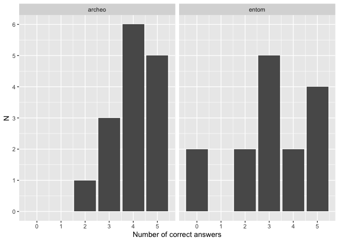

```{r, include=FALSE}
# load packages
library(tidyverse)
library(kableExtra)
library(lme4)
library(broom.mixed)
```


```{r, include=FALSE}
# make up some data to show code examples
# Set seed for reproducibility
set.seed(123)

# Generate the dataset
data <- tibble(
  id = 1:200,
  treatment = sample(0:1, 200, replace = TRUE),
  knowledge = sample(0:5, 200, replace = TRUE),
  impressiveness = sample(1:5, 200, replace = TRUE),
  trust = sample(1:5, 200, replace = TRUE),
  competence = sample(1:5, 200, replace = TRUE)
)

```

# I. Introduction

Does people's knowledge about science vanish faster than their impression of science as being trustworthy? 

The deficit model suggests that people do not trust science (enough), because they do not know enough about it. Accordingly, more knowledge about science generates trust. Here, we want to contrast this model with an alternative one: the trust-by-impression account. According to this model, people trust science at time T+1 not so much because they know about it at time T+1, but because they have been impressed by it at time T.

An implication of the deficit model is that trust should only co-occur with knowledge. For example, someone who doesn't have a minimum of astronomy knowledge (e.g. doesn't know that the earth revolves around the sun) has no reason to trust astronomers at all. By contrast, the trust-by-impression account could explain why someone without much knowledge might nevertheless trust astronomers: it requires only that a person has (at some point) been impressed by the finding of astronomers. They might have forgotten the details or even what it was, but the impression of trustworthiness remains. 

In two previous experiments, we have shown that exposure to impressive scientific content increases trust in scientists. In this experiment, we test if this trust in scientists persists, and if it persists more than specific knowledge about the content.


```{r, echo=FALSE}
# Alternative design

# In line with both accounts, we first need to show that exposure to impressive scientific content increases trust in science, and persistently so. In a second step, we can then test if this newly induced trust persists more than the knowledge its content. The deficit model suggests that knowledge and trust persist to the same extent. If, however, knowledge vanishes while trust persists, this would be evidence in favor of the trust-by-impression account.

# We propose the following design. We have three experimental group: (i) a baseline control group that receives a non-impressive science vignette (as established by previous experiments), (ii) a treatment group that receives an impressive science vignette, and (iii) a second treatment group that also receives an impressive science vignette, but which answers questions after a decoy task of 5 to 10mins.

# steps: 
# a) new information changes trust in science (baseline control vs. impressive treatment.)
# b) trust in science persists more than science knowledge (impressive treatment vs. impressive + decoy treatment)
```

# II. Data collection

No data has been collected yet. We ran a pilot study to investigate how people perform in the knowledge quiz about the vignettes. The results suggested that people do rather well overall, but are not at ceiling either. We are therefore confident that our findings will not be overly influenced by ceiling/floor effects (see Fig. \@ref(fig:pilot-plot)). 

(ref:pilot-plot) Results of Knowledge scores from participants in a pilot study.

```{r pilot-plot, echo=FALSE, fig.cap="(ref:pilot-plot)", out.width = "80%", fig.align="center"}

```

# III. Design

All participants will read a vignette, established as impressive and trust enhancing in previous experiments (Table \@ref(tab:stimuli)). We will randomize whether this vignette is about archaeology or entomology. Right after reading the vignette, all participants will answer four seemingly relevant questions about the vignette, but which are of no interest to our hypotheses. The aim of these questions is to make the following distraction task for the treatment group less obvious. We then randomly assign participants to two groups: In the control group, people proceed immediately to answer all outcome questions. In the treatment group, participants engage in a 5min distraction task before proceeding to the same outcome questions. The distraction task consists of reading two vignettes that are completely unrelated and answer a couple of questions about them.

## Materials

### Vignettes

The vignette of Table \@ref(tab:stimuli) texts correspond to the "impressive" condition of experiment 2.

```{r stimuli, echo=FALSE}
# Create a matrix of image file paths as Markdown-formatted strings
table <- data.frame(
  archaeology = "Archaeologists, scientists who study human history and prehistory, are able to tell, from their bones, whether someone was male or female, how old they were, and whether they suffered from a range of diseases. Archaeologists can now tell at what age someone, dead for tens of thousands of years, stopped drinking their mother’s milk, from the composition of their teeth.

Archaeologists learn about the language that our ancestors or cousins might have had. For instance, the nerve that is used to control breathing is larger in humans than in apes, plausibly because we need more fine-grained control of our breathing in order to speak. As a result, the canal containing that nerve is larger in humans than in apes – and it is also enlarged in Neanderthals.

Archaeologists can also tell, from an analysis of the tools they made, that most Neanderthals were right-handed. It’s thought that handedness is related to the evolution of language, another piece of evidence suggesting that Neanderthals likely possessed a form of language.
",
  Entomology = "Entomologists are the scientists who study insects. Some of them have specialized in understanding how insects perceive the world around them, and they have uncovered remarkable abilities. 

Entomologists interested in how flies’ visual perception works have used special displays to present images for much less than the blink of an eye, electrodes to record how individual cells in the flies’ brain react, and ultra-precise electron microscopy to examine their eyes. Thanks to these techniques, they have shown that some flies can perceive images that are displayed for just three milliseconds (a thousandth of a second) – about ten times shorter than a single movie frame (of which there are 24 per second). 

Entomologists who study the hair of crickets have shown that these microscopic hairs, which can be found on antenna-like organs attached to the crickets’ rear, are maybe the most sensitive organs in the animal kingdom. The researchers used extremely precise techniques to measure how the hair reacts to stimuli, such as laser-Doppler velocimetry, a technique capable of detecting the most minute of movements. They were able to show that the hair could react to changes in the motion of the air that had less energy than one particle of light, a single photon.
"
)

# Use kable() to create the table and print it as Markdown
kableExtra::kable(table, 
                  col.names = c( "Archaeology", "Entomology"),
                  caption = "Stimuli",
                  align = "l", 
                  booktabs = T,
                  longtable = TRUE) %>%
  kable_paper(full_width = FALSE) %>%
  column_spec(1, width = "20em") %>%
  column_spec(2, width = "20em") 
```

### Decoy questions

These are the questions that are irrelevant to our hypotheses, and which are only intended to make the following distraction task less obvious to participants in the treatment group. 

We will ask participants how clear the text is [1 - Not clear at all, 2 - Not very clear, 3 - Neither clear nor not clear, 4 - Quite clear, 5 - Very clear] and if the text presented any new or surprising information to them [1 - None at all, 2 - Very little, 3 - Moderately, 4 - Quite a bit, 5 - A significant amount]. We will then ask them if they think that archaeologists/entomologists are more knowledgeable than they thought they were before [1 - Strongly disagree, 2 - Disagree, 3 - Neither agree nor disagree, 4 - Agree, 5 - Strongly agree] and how much they felt they have learned about human history/insects by reading the text [1 - Nothing, 2 - A bit, 3 - Some, 4 - Quite a bit, 5 - A lot].

### Outcome measures

**Knowledge**. We ask participants 5 multiple choice questions about the content of the vignette that they read (Table \@ref(tab:knowledge)). For each question, participants get 1 point for the correct answer, and 0 points for any other answer. We calculate an overall knowledge score as the sum of points for all five questions, such that the maximum score is 5 and the minimum score is 0. 

```{r knowledge, echo=FALSE}
block <- data.frame(
  Archaeology = c("According to the text, what can archaeologists determine from examining bones? 
a) Gender, age, and past diseases 
b) Gender, age, and handedness
c) Gender and age
d) Gender, age, past diseases, and handedness
(correct answer: a)
",
"",
"According to the text, how do archaeologists determine at what age someone stopped drinking their mother’s milk?
a) By analyzing their bones 
b) By examining their hair 
c) By studying their teeth 
d) By observing their burial rituals
(correct answer: c)
",
"",
"The text mentions nerves that are particularly enlarged in humans compared to apes, which are they? 
a) The nerves that control fine hand movements
b) The nerves that control breathing
c) The nerves that balance for bipedal motion
d) The nerves that control the digestive system
(correct answer: b)
",
"",
"Why is the canal containing a nerve going from the brain to the thorax enlarged in Neanderthals? 
a) Because Neanderthals had a different diet
b) Because Neanderthals engaged in increased physical activity 
c) Because Neanderthals were left-handed 
d) Because Neanderthals were able to speak

(correct answer: d)
",
"",
"According to the text, what evidence suggests that most Neanderthals were right-handed? 
a) Analysis of their bones 
b) Analysis of their tools 
c) Examination of their teeth 
d) Observation of their cave paintings
(correct answer: b)
"),
  Entomology = c("Which techniques have entomologists used to study flies' visual perception?

A) Sonar imaging
B) Electron microscopy 
C) X-ray diffraction 
D) Mass spectrometry

(correct answer: b)

",
"",
"What is the order or magnitude of the shorter displays flies can perceive?

A) Picoseconds
B) Nanoseconds
C) Microseconds
D) Milliseconds

(correct answer: d)
",
"",
"Where are the sensitive hairs found on crickets located?

   A) Legs  
   B) Wings  
   C) Rear  
   D) Head  

(correct answer: c)
",
"",
"What technique did entomologists use to study the sensitivity of cricket hairs?

   A) Mass spectrometry  
   B) Electron microscopy  
   C) Laser-Doppler velocimetry  
   D) Sonar imaging  

(correct answer: c)
",
"",
"According to the passage, how sensitive are the cricket hairs to air motion changes?

   A) They react to changes equivalent to the energy of a single photon.  
   B) They react to changes equivalent to the energy of a single atom.  
   C) They react to changes equivalent to the energy of a single grain of sand.
   D) They react to changes equivalent to the energy of a single breath.  
(correct answer: a)
")
) 

# Use kable() to create the table and print it as Markdown
kableExtra::kable(block, 
                  col.names = c("Archaeology", "Entomology"),
                  caption = "Questions",
                  align = "l", 
                  booktabs = T,
                  longtable = TRUE) %>%
  kable_paper(full_width = FALSE) %>%
  column_spec(1, width = "20em", extra_css = "padding: 20px;", border_right = TRUE) %>%
  column_spec(2, width = "20em", extra_css = "padding: 20px;") 
```

**Impressiveness**. We measure impressiveness by asking participants: “How impressive do you think the findings of the archaeologists/entomologists described in the text are?” [1 - Not impressive at all, 2 - Not very impressive, 3 - Neither impressive nor not impressive, 4 - Quite impressive, 5 - Very impressive]

**Competence**. We measure competence by asking participants: "How competent do you think archaeologists/entomologists are?" [1 - Not competent at all, 2 - Not very competent, 3 - Neither competent nor not competent, 4 - Quite competent, 5 - Very competent]

**Trust**. We measure trust by asking participants: "How much would you trust the discipline of archaeologists/entomologists ?" [1 - Not trust them at all, 2 - Not trust them much, 3 - Neither trust them or not trust them, 4 - Trust them quite a bit, 5 - Trust them a lot]

# IV. Hypotheses

We expect people to forget quickly (during the time of a short distraction task) about precise content, but that the impressions they gain about scientists’ trustworthiness persist. In other words, we predict that the difference in knowledge performance between treatment and control group is larger (more negative) than the difference in trust (impressiveness/competence). 

H1: The difference in knowledge performance between treatment and control group is larger (more negative) than the difference in ...

- H1a: ...trust.

- H1b: ...impressiveness.

- H1c: ...competence.

We are going to test these hypotheses with the following model:

$$
value = (\beta_{0} + b_\text{0, participant}) + \beta_{1} Treatment + \beta_{2} Outcome + \beta_{3} (Treatment \times Outcome) + \epsilon
$$

$$
b_\text{0, participant} \sim \mathcal{N}(0, \sigma^2_{participant})
$$

In this model, the dependent variable "value" represents a standardized version of the Likert scale rating. The variable "Treatment" is a binary indicator, where a value of 1 signifies that participants were exposed to the decoy (treatment group) and a value of 0 indicates that they were not (control group). The "Outcome" variable is also binary, distinguishing outcome measures: a value of 1 represents knowledge, while a value of 0 represents (in different models) one of the other outcomes, i.e. trust, impressiveness, or competence. The interaction term ("Treatment x Outcome") captures the difference in the treatment effect between these outcome measures. For example, a statistically significant, negative interaction coefficient suggests that the difference between control and decoy group was larger for the knowledge measure than for trust/competence/impressiveness. Random intercepts for participants ($b_\text{0, participant}$) are included in the model to account for individual variability. These random intercepts are assumed to follow a normal distribution with a variance of $\sigma^2_{participant}$.

In R code, we will proceed as follows: 

We start out with a standard, wide-format data frame with one row per participant.

```{r}
data %>% 
  slice(1:2)
```

We first standardize our outcome variables.

```{r}
# Scale all variables except id
data <- data %>%
  mutate(across(c(knowledge, trust, impressiveness, competence), scale))
```

We then transform our data frame in wide format (one row per participant) to long format.

```{r}
# Convert to long format
data_long <- data %>%
  pivot_longer(cols = c(knowledge, trust, impressiveness, competence), 
               names_to = "outcome", values_to = "value")

head(data_long)
```

Make a numeric version of outcome to calculate models. 

```{r}
data_long <- data_long %>% 
  # add a numeric version
  mutate(outcome_numeric = ifelse(outcome == "knowledge", 1, 0))

data_long %>%
  select(outcome, outcome_numeric) %>%
  head()
```

We filter the outcome variable to include only the pair we care about (depending on the hypothesis). The example below is for trust as outcome.

```{r}
data_H1 <- data_long %>% 
  filter(outcome == "knowledge" | outcome == "trust")
```

We then run a mixed model with random intercepts on the data, using the lmer function.

```{r, warning=FALSE, message=FALSE}
# mixed model
model_H1 <- lmer(value ~ treatment * outcome_numeric + (1 | id), data = data_H1)
```

# Exclusions

We will exclude participants failing (i.e. participants not answering the question or writing anything that does not at least resemble "I pay attention") the following attention check:

> *Imagine you are playing video games with a friend and at some point your friend says: "I don't want to play this game anymore! To make sure that you read the instructions, please write the three following words"I pay attention" in the box below. I really dislike this game, it's the most overrated game ever. Do you agree with your friend?*

# Power analysis

We ran a power simulation to inform our choice of sample size. All assumptions and details on the procedure can be found in the `power_exp3.Rmd` document. Fig. \@ref(fig:power-plot) displays the results of this simulation. We tested three different methods to estimate our effect (the colors in the plot), which are described in more detail in the power simulation document. Two of these methods were nearly identical in their statistical power, so among these, we picked the one we were more familiar with to test our hypotheses: a mixed model with an interaction effect. 

We set the power threshold for our experiment to 90%. 

The power simulation suggested that with 150 participants, we would cross the power threshold of 90% for the interaction effect (power = 0.958). 

Due to uncertainty about our parameters for the simulations, and because the budget allows it, we will recruit a sample of 200 participants. 

(ref:power-plot) Results of Knowledge scores from participants in a pilot study.

```{r power-plot, echo=FALSE, fig.cap="(ref:power-plot)", out.width = "80%", fig.align="center"}
knitr::include_graphics("power_exp3_files/figure-html/plot-power-1.png")
```


