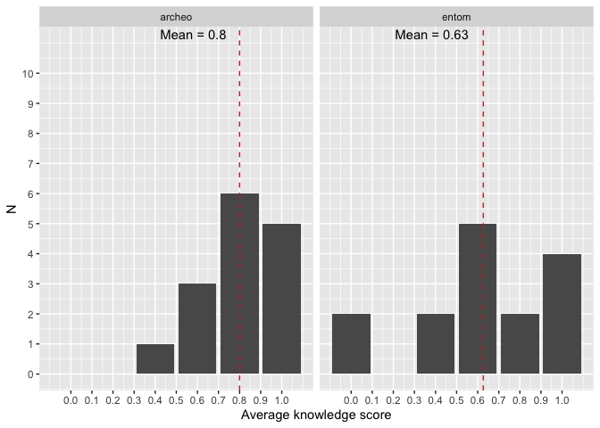
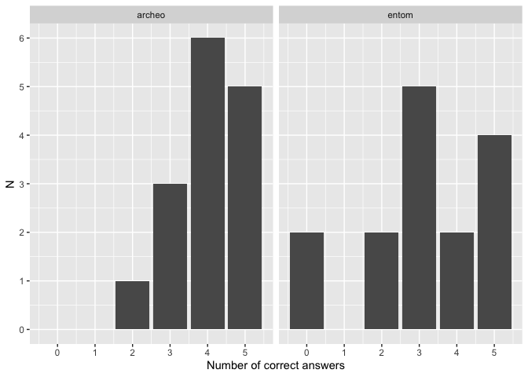
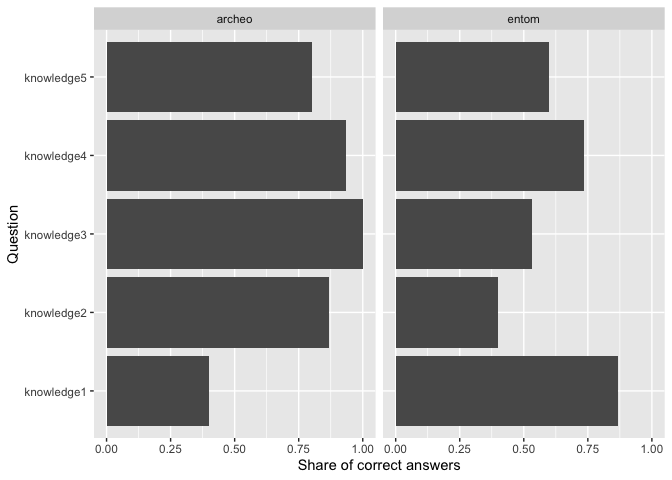

```
## # A tibble: 5 × 3
##   knowledge_avg     n share
##           <dbl> <dbl> <dbl>
## 1           0       2 0.067
## 2           0.4     3 0.1  
## 3           0.6     8 0.267
## 4           0.8     8 0.267
## 5           1       9 0.3
```

<!-- -->


```
## # A tibble: 2 × 2
##   discipline n_correct
##   <chr>          <int>
## 1 archeo             4
## 2 entom              5
```

<!-- -->

<!-- -->


